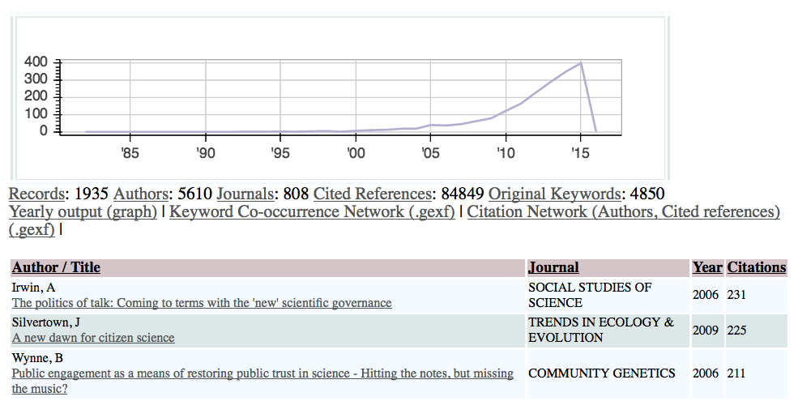

# Cite.py

A Python program for analyzing bibliographic data in your browser. The current version supports data exported from the Thomson Reuters Web of Science.

Features include:

* Sort publications by Author, Years, Keywords, Source, Times Cited.
* Analyze Cited References
* Export word co-occurrence networks and co-author networks as .gexf files for further analysis in [Gephi](http://gephi.org).

### Requirements
This program is written in Python 3. The following external packages are required:

* pandas
* bokeh
* lxml
* pygexf

Depending on your platform, lxml and pygexf may have to be installed from source rather than relying on the standard package managers.

#### External dependency bundled with this repository
This program uses [Tsorter by Terrill Dent](https://github.com/terrilldent/tsorter), which is licensed under the MIT licence.  

## Usage
**Input data**: Use with data exported as .tsv files from [Web of Science](http://webofknowledge.com).

    python3 Cite.py YOURDATA.tsv

The script will automatically start up a webserver running on port 8000. Go to ``localhost:8000`` with your favourite browser (supporting javascript).
